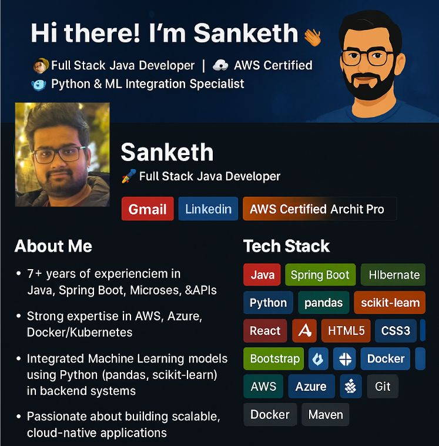

  

<h1 align="center">Hi there! I'm Sanketh 👋</h1>
<h3 align="center">🚀 Full Stack Java Developer | ☁️ AWS Certified | 🤖 Python & ML Integration Specialist</h3>

  
  
  

---

## 🧑‍💻 About Me

- 👨‍💻 7+ years of experience in **Java, Spring Boot, Microservices, and RESTful APIs**
- ☁️ Strong expertise in **AWS, Azure**, and **Docker/Kubernetes**
- 🧠 Integrated **Machine Learning models** using **Python (pandas, scikit-learn)** in backend systems
- ⚙️ CI/CD automation, container orchestration, and distributed messaging with **Kafka, RabbitMQ**
- 💬 Passionate about building scalable, cloud-native applications

---

## 🛠️ Tech Stack

### 💻 Backend & Frameworks

  
  
  
  
  

### 🐍 Python & Machine Learning

  
  
  

### 🌐 Frontend

  
  
  
  
  

### ☁️ Cloud & DevOps

  
  
  
  
  
  

### 🔗 Messaging, Monitoring & CI/CD

  
  
  
  
  

---

## 📁 Top Repositories

| Project | Description |
|--------|-------------|
| 🔗 [springboot-python-ml-integration](https://github.com/Sankethsankuri/springboot-python-ml-integration) | Integration of a Python ML model with Spring Boot microservice using Kafka and REST |
| 🔗 [react-springboot-microservice-ui](https://github.com/Sankethsankuri/react-springboot-microservice-ui) | Frontend SPA in React.js connected to Spring Boot microservices |
| 🔗 [expense-tracker-backend](https://github.com/Sankethsankuri/expense-tracker-backend) | Expense Tracker Backend Services |
| 🔗 [expense-tracker-frontend](https://github.com/Sankethsankuri/expense-tracker-frontend) | Expense Tracker Frontend |
| 🔗 [movie-service](https://github.com/Sankethsankuri/movie-service) | Movie Services |

---

## 📊 GitHub Stats & Activity

  
  

  

---

## 🧾 Work Experience Highlights

### 💼 Church of Jesus Christ of Latter-Day Saints (2023–Present)
- Migrated JSP/Servlets to Spring Boot microservices
- Integrated Python ML models with Java APIs
- Secured APIs with JWT & OAuth2
- Deployed apps using Docker on Kubernetes & AWS

### 💼 Huntington National Bank (2022–2023)
- Built secure financial microservices using Spring Boot & WebFlux
- Deployed to AWS & Azure AKS
- Kafka messaging and PL/SQL integration

### 💼 Optum (2021–2022)
- Built Angular 7 SPAs and integrated them with Spring Boot APIs
- Automated deployments using Jenkins and OpenShift
- Used AWS Lambda & DynamoDB for real-time processing

---

## 📜 Certifications

- 🏅 **AWS Certified Solutions Architect – Professional** (Aug 2023)
Credential ID: AWS03849156
Issued: August 2023 

- 🤖 **Foundations of AI & ML for Java Developers** (Jul 2025)
Credential ID: 11b24dbddca43f764590479ae4467ccc8630bf96bb7eeec0e10eac26c5c020e0
Issued: July 2025

---

## 📫 Let's Connect!

- 📧 **Email**: sankethfsd9@gmail.com  
- 🌐 **LinkedIn**: [linkedin.com/in/sanketh-javafullstack-developer](http://linkedin.com/in/sanketh-javafullstack-developer)  
- 💼 **Available for Freelance / Remote Roles / Contracts**

---

## 🔥 Fun Fact

> “Code. Deploy. Scale. Repeat. 🔁 
> Transforming business logic into seamless digital experiences!” 🚀

---

